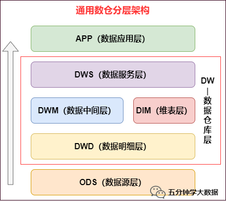
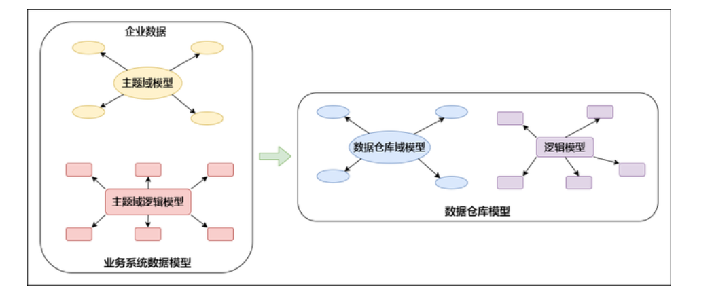
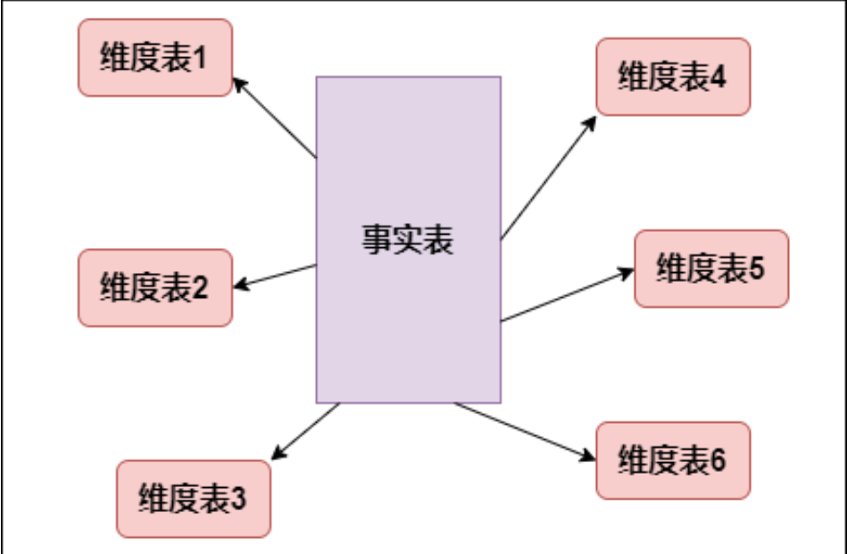
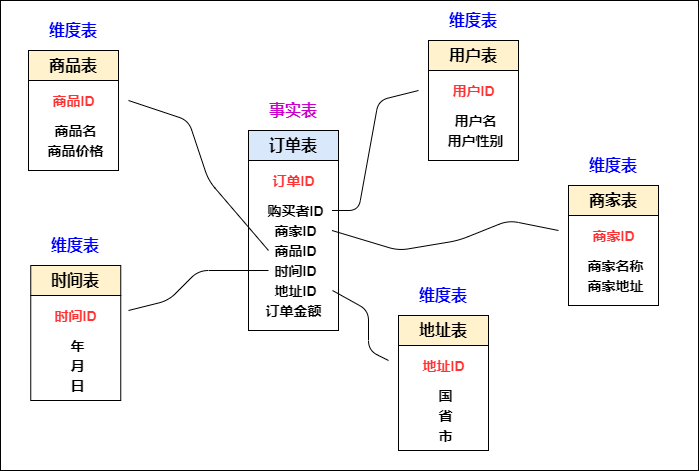

#### **离线数仓建设核心**

##### **数据仓库的核心是展现层和提供优质的服务。ETL 及其规范、分层等所做的一切都是为了一个更清晰易用的展现层。**

##### **1. 数仓分层**

```
数仓分层的原则

为便于数据分析，要屏蔽底层复杂业务，简单、完整、集成的将数据暴露给分析层。
底层业务变动与上层需求变动对模型冲击最小化，业务系统变化影响削弱在基础数据层，结合自上而下的建设方法削弱需求变动对模型的影响。
高内聚松耦合，即主题之内或各个完整意义的系统内数据的高内聚，主题之间或各个完整意义的系统间数据的松耦合。
构建仓库基础数据层，使底层业务数据整合工作与上层应用开发工作相隔离，为仓库大规模开发奠定基础 仓库层次更加清晰，对外暴露数据更加统一。
一般采用如下分层结构：
```



```
1. 数据源层：ODS（Operational Data Store）
ODS 层，是最接近数据源中数据的一层，为了考虑后续可能需要追溯数据问题，因此对于这一层就不建议做过多的数据清洗工作，原封不动地接入原始数据即可，至于数据的去噪、去重、异常值处理等过程可以放在后面的 DWD 层来做。

2. 数据仓库层：DW（Data Warehouse）
数据仓库层是我们在做数据仓库时要核心设计的一层，在这里，从 ODS 层中获得的数据按照主题建立各种数据模型。

DW 层又细分为 DWD（Data Warehouse Detail）层、DWM（Data WareHouse Middle）层和 DWS（Data WareHouse Servce） 层。

1) 数据明细层：DWD（Data Warehouse Detail）
该层一般保持和 ODS 层一样的数据粒度，并且提供一定的数据质量保证。DWD 层要做的就是将数据清理、整合、规范化、脏数据、垃圾数据、规范不一致的、状态定义不一致的、命名不规范的数据都会被处理。

同时，为了提高数据明细层的易用性，该层会采用一些维度退化手法，将维度退化至事实表中，减少事实表和维表的关联。

另外，在该层也会做一部分的数据聚合，将相同主题的数据汇集到一张表中，提高数据的可用性 。

2) 数据中间层：DWM（Data WareHouse Middle）
该层会在 DWD 层的数据基础上，数据做轻度的聚合操作，生成一系列的中间表，提升公共指标的复用性，减少重复加工。

直观来讲，就是对通用的核心维度进行聚合操作，算出相应的统计指标。

在实际计算中，如果直接从 DWD 或者 ODS 计算出宽表的统计指标，会存在计算量太大并且维度太少的问题，因此一般的做法是，在 DWM 层先计算出多个小的中间表，然后再拼接成一张 DWS 的宽表。由于宽和窄的界限不易界定，也可以去掉 DWM 这一层，只留 DWS 层，将所有的数据再放在 DWS 亦可。

3) 数据服务层：DWS（Data WareHouse Servce）
DWS 层为公共汇总层，会进行轻度汇总，粒度比明细数据稍粗，基于 DWD 层上的基础数据，整合汇总成分析某一个主题域的服务数据，一般是宽表。DWS 层应覆盖 80% 的应用场景。又称数据集市或宽表。

按照业务划分，如主题域流量、订单、用户等，生成字段比较多的宽表，用于提供后续的业务查询，OLAP 分析，数据分发等。

一般来讲，该层的数据表会相对比较少，一张表会涵盖比较多的业务内容，由于其字段较多，因此一般也会称该层的表为宽表。

3. 数据应用层：APP（Application）
在这里，主要是提供给数据产品和数据分析使用的数据，一般会存放在 ES、 PostgreSql、Redis 等系统中供线上系统使用，也可能会存在 Hive 或者 Druid 中供数据分析和数据挖掘使用。比如我们经常说的报表数据，一般就放在这里。

4. 维表层：DIM（Dimension）
如果维表过多，也可针对维表设计单独一层，维表层主要包含两部分数据：

高基数维度数据：一般是用户资料表、商品资料表类似的资料表。数据量可能是千万级或者上亿级别。

低基数维度数据：一般是配置表，比如枚举值对应的中文含义，或者日期维表。 数据量可能是个位数或者几千几万。
```

##### 2. 数仓建模方法

```
数仓建模在哪层建设呢？我们以维度建模为例，建模是在数据源层的下一层进行建设，在上节的分层架构中，就是在DW层进行数仓建模，所以DW层是数仓建设的核心层。

那数仓建模怎么建呢？其实数据仓库的建模方法有很多种，每一种建模方法代表了哲学上的一个观点，代表了一种归纳、概括世界的一种方法。常见的有 范式建模法、维度建模法、实体建模法等，每种方法从本质上将是从不同的角度看待业务中的问题。

1. 范式建模法（Third Normal Form，3NF）
范式建模法其实是我们在构建数据模型常用的一个方法，该方法的主要由 Inmon 所提倡，主要解决关系型数据库的数据存储，利用的一种技术层面上的方法。目前，我们在关系型数据库中的建模方法，大部分采用的是三范式建模法。

范式 是符合某一种级别的关系模式的集合。构造数据库必须遵循一定的规则，而在关系型数据库中这种规则就是范式，这一过程也被称为规范化。目前关系数据库有六种范式：第一范式（1NF）、第二范式（2NF）、第三范式（3NF）、Boyce-Codd范式（BCNF）、第四范式（4NF）和第五范式（5NF）。

在数据仓库的模型设计中，一般采用第三范式。一个符合第三范式的关系必须具有以下三个条件 :

每个属性值唯一，不具有多义性 ;
每个非主属性必须完全依赖于整个主键，而非主键的一部分 ;
每个非主属性不能依赖于其他关系中的属性，因为这样的话，这种属性应该归到其他关系中去。

```



```
2. 维度建模法（Dimensional Modeling）
维度模型是数据仓库领域另一位大师Ralph Kimall所倡导，他的《数据仓库工具箱》是数据仓库工程领域最流行的数仓建模经典。维度建模以分析决策的需求出发构建模型，构建的数据模型为分析需求服务，因此它重点解决用户如何更快速完成分析需求，同时还有较好的大规模复杂查询的响应性能。
```



```
典型的代表是我们比较熟知的星形模型（Star-schema），以及在一些特殊场景下适用的雪花模型（Snow-schema）。

维度建模中比较重要的概念就是 事实表（Fact table）和维度表（Dimension table）。其最简单的描述就是，按照事实表、维度表来构建数据仓库、数据集市。
```

```
3. 维度建模详解
目前在互联网公司最常用的建模方法就是维度建模，我们将重点讲解！

维度建模是专门应用于分析型数据库、数据仓库、数据集市建模的方法。数据集市可以理解为是一种"小型数据仓库"。

我们先不着急开始维度建模，先来了解下维度建模中表的类型和维度建模的模式之后再开始建模，这样能够让我们深刻理解！

1. 维度建模中表的类型
维度建模分为两种表：事实表和维度表：

事实表：必然存在的一些数据，像采集的日志文件，订单表，都可以作为事实表 。
特征：是一堆主键的集合，每个主键对应维度表中的一条记录，客观存在的，根据主题确定出需要使用的数据
维度表：维度就是所分析的数据的一个量，维度表就是以合适的角度来创建的表，分析问题的一个角度：时间、地域、终端、用户等角度
1. 事实表
发生在现实世界中的操作型事件，其所产生的可度量数值，存储在事实表中。从最低的粒度级别来看，事实表行对应一个度量事件，反之亦然。

事实表表示对分析主题的度量。比如一次购买行为我们就可以理解为是一个事实。
```



```
图中的订单表就是一个事实表，你可以理解他就是在现实中发生的一次操作型事件，我们每完成一个订单，就会在订单中增加一条记录。 事实表的特征：表里没有存放实际的内容，他是一堆主键的集合，这些ID分别能对应到维度表中的一条记录。事实表包含了与各维度表相关联的外键，可与维度表关联。事实表的度量通常是数值类型，且记录数会不断增加，表数据规模迅速增长

```

```
请牢记以上四步，不管什么业务，就按照这个步骤来，顺序不要搞乱，因为这四步是环环相扣，步步相连。下面详细拆解下每个步骤怎么做

1、选择业务过程
维度建模是紧贴业务的，所以必须以业务为根基进行建模，那么选择业务过程，顾名思义就是在整个业务流程中选取我们需要建模的业务，根据运营提供的需求及日后的易扩展性等进行选择业务。比如商城，整个商城流程分为商家端，用户端，平台端，运营需求是总订单量，订单人数，及用户的购买情况等，我们选择业务过程就选择用户端的数据，商家及平台端暂不考虑。业务选择非常重要，因为后面所有的步骤都是基于此业务数据展开的。

2、声明粒度
先举个例子：对于用户来说，一个用户有一个身份证号，一个户籍地址，多个手机号，多张银行卡，那么与用户粒度相同的粒度属性有身份证粒度，户籍地址粒度，比用户粒度更细的粒度有手机号粒度，银行卡粒度，存在一对一的关系就是相同粒度。为什么要提相同粒度呢，因为维度建模中要求我们，在同一事实表中，必须具有相同的粒度，同一事实表中不要混用多种不同的粒度，不同的粒度数据建立不同的事实表。并且从给定的业务过程获取数据时，强烈建议从关注原子粒度开始设计，也就是从最细粒度开始，因为原子粒度能够承受无法预期的用户查询。但是上卷汇总粒度对查询性能的提升很重要的，所以对于有明确需求的数据，我们建立针对需求的上卷汇总粒度，对需求不明朗的数据我们建立原子粒度。

3、确认维度
维度表是作为业务分析的入口和描述性标识，所以也被称为数据仓库的“灵魂”。在一堆的数据中怎么确认哪些是维度属性呢，如果该列是对具体值的描述，是一个文本或常量，某一约束和行标识的参与者，此时该属性往往是维度属性，数仓工具箱中告诉我们牢牢掌握事实表的粒度，就能将所有可能存在的维度区分开，并且要确保维度表中不能出现重复数据，应使维度主键唯一

4、确认事实
事实表是用来度量的，基本上都以数量值表示，事实表中的每行对应一个度量，每行中的数据是一个特定级别的细节数据，称为粒度。维度建模的核心原则之一是同一事实表中的所有度量必须具有相同的粒度。这样能确保不会出现重复计算度量的问题。有时候往往不能确定该列数据是事实属性还是维度属性。记住最实用的事实就是数值类型和可加类事实。所以可以通过分析该列是否是一种包含多个值并作为计算的参与者的度量，这种情况下该列往往是事实。

数据流向
遵循模型开发时分层结构，数据从 ods -> dw -> dm ->app 这样正向流动，可以防止因数据引用不规范而造成数据链路混乱及SLA时效难保障等问题，同时保证血缘关系简洁化，能够轻易追踪数据流向。 在开发时应避免以下情况出现：

数据引用链路不正确，如 ods -> dm ->app ，出现这种情况说明明细层没有完全覆盖数据；如 ods -> dw -> app ，说明轻度汇总层主题划分未覆盖全 。减少跨层引用，才能提高中间表的复用度。理想的数仓模型设计应当具备：数据模型可复⽤，完善且规范。
尽量避免一层的表生成当前层的表，如dw层表生成dw层表，这样会影响ETL效率。
禁止出现反向依赖，如dw表依赖于dm表


规范
表命名规范
对于ods、dm、app层表名：类型_主题_表含义，如：dm_xxsh_user
对于dw层表名：类型_主题_维度_表含义，如：dw_xxsh_fact_users（事实表）、dw_xxsh_dim_city（维度表）
字段命名规范
构建词根，词根是维度和指标管理的基础，划分为普通词根与专有词根
普通词根：描述事物的最小单元体，如：sex-性别。
专有词根：具备行业专属或公司内部规定的描述体，如：xxsh-公司内部对某个产品的称呼。
脚本命名规范
脚本名称：脚本类型.脚本功用.[库名].脚本名称，如 hive.hive.dm.dm_xxsh_users
脚本类型主要分为以下三类：
常规Hive sql：hive
自定义shell脚本：sh
自定义Python脚本：python
脚本内容规范
#变量的定义要符合python的语法要求
#指定任务负责人
owner = "zhangsan@xxx.com"
#脚本存放目录/opt/xxx
#脚本名称 hive.hive.dm.dm_xxsh_users
#source用来标识上游依赖表，一个任务如果有多个上游表，都需要写进去
#(xxx_name 是需要改动的，其余不需要改)
source = {
        "table_name": {
        "db": "db_name",
        "table": "table_name"
        }
}
#如source，但是每个任务target只有一张表
target = {
        "db_table": {
                "host": "hive",
                "db": "db_name",
                "table": "table_name"
        }
}
#变量列表
#$now
#$now.date 常用，格式示例：2020-12-11

 
task = '''
写sql代码
'''
```

